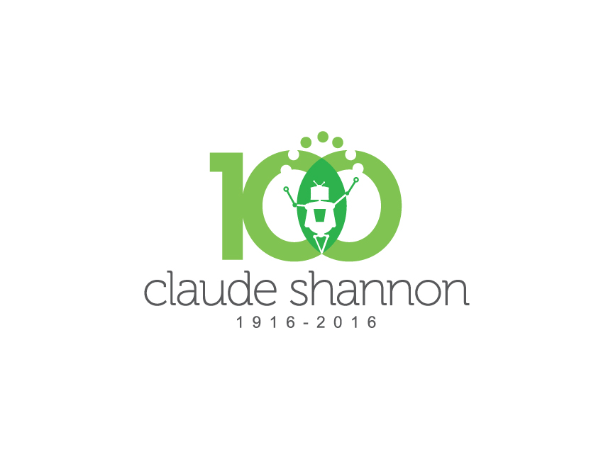

In honor of the Shannon Centenary, events will be taking place at Texas A&M University on April 9, 2016.
These events are planned in conjunction with the [Physics and Engineering Festival](http://physicsfestival.tamu.edu/).
The Organizing Committee for the Shannon Centenary invites the public to a series of entertaining and informative events with puzzles, posters and a presentation.
Everyone is welcome to participate.

## Schedule

* April 9 at 12:00PM: Public Lecture – **Claude Shannon: A Pioneer of the Information Age** – Jack E. Brown Chemical Engineering Building, Room 106.

Claude Shannon is one of the most influential scientists of the 20th century and is considered to be the father of the digital age. In his landmark paper published in 1948, he developed an elegant theory called information theory, which introduced the modern concept of information and provided guidelines on how to efficiently acquire, compress, store and transmit information. Just as how Newton's and Einstein's theories revolutionized our understanding of the physical world, Shannon's information theory has revolutionized our understanding of the digital world.

In this interactive presentation, we will introduce the main ideas behind information theory through hands-on activities.
We will also show how information theory has shaped the development of CD players, Ipods, hard disks, flash memories, deep-space communications, cellular phones and wireless networks, to name a few.
The presentation is aimed at the general public and only requires curiosity about high-tech gadgets. Middle school and high school students are highly encouraged to attend. 

